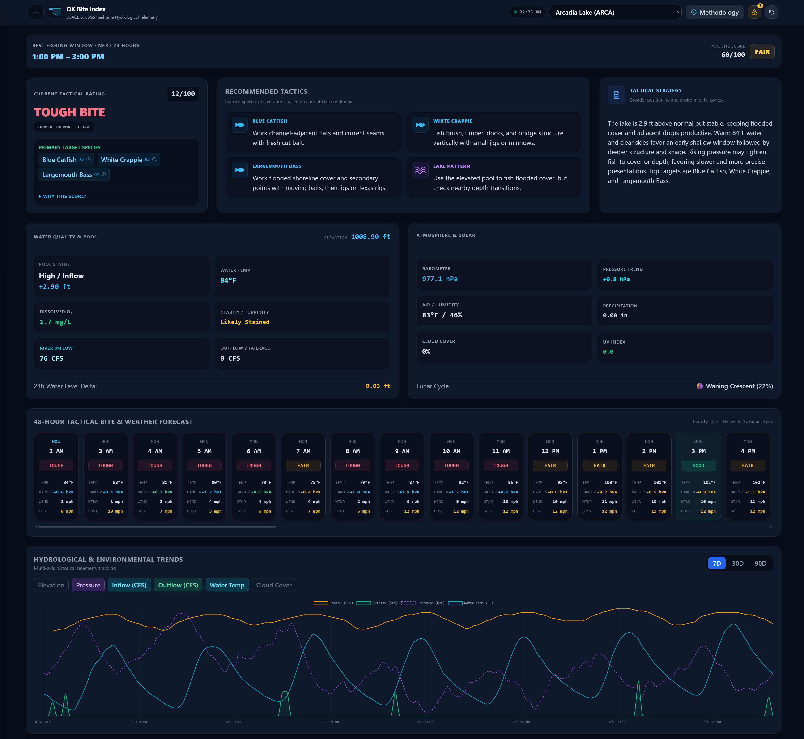
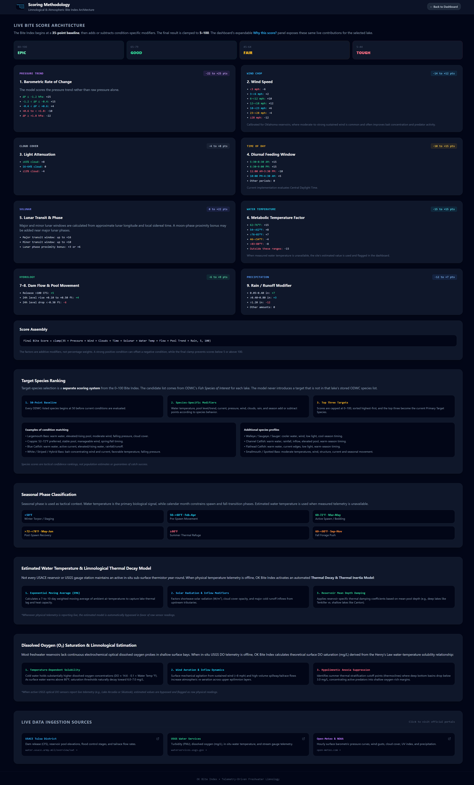

# OK Bite Index

Oklahoma lake telemetry, fishing-condition analysis, forecasting, and tactical recommendation platform.

OK Bite Index combines real-time hydrological and weather observations with lake-specific data to generate a dynamic fishing Bite Index, target-species rankings, recommended tactics, fishing windows, and lake-condition analysis.

## Screenshots

### Main Dashboard



### Scoring Methodology



## Features

- Real-time Oklahoma lake telemetry
- Current weather conditions and forecasts
- Lake elevation and normal-pool deviation monitoring
- Inflow and dam release monitoring where available
- Water temperature and water-quality observations where available
- Dynamic 0–100 Bite Index
- Target-species rankings and confidence scores
- Condition-based fishing tactics
- Seasonal fishing-pattern analysis
- Best fishing window for the next 24 hours
- ODWC fishing regulations and lake-species information
- Data-source freshness monitoring
- Related-project alerts
- Responsive desktop, tablet, and mobile interface

## Data Sources

### USGS

USGS monitoring stations provide available hydrological and water-quality observations. Depending on the station, these can include:

- Water-surface elevation
- Discharge / flow
- Water temperature
- Dissolved oxygen
- Turbidity

Available parameters vary by lake and monitoring station.

### USACE

USACE data is used where available for reservoir and dam operational information, including outlet discharge.

### Open-Meteo

Open-Meteo provides current atmospheric conditions and forecast data used by the Bite Index and fishing-window calculations, including:

- Air temperature
- Surface pressure
- Wind speed
- Cloud cover
- Precipitation
- UV index

### Oklahoma Department of Wildlife Conservation

ODWC data is synchronized to provide lake-specific fishing information, including:

- Fishing regulations
- Species information
- Links to official ODWC lake and fishing resources

### City of Edmond ArcGIS

The City of Edmond's Current Public and Capital Improvement Projects ArcGIS StoryMap is used to monitor projects related to Arcadia Lake.

Related-project ingestion is currently limited to **Arcadia Lake**.

## Bite Index

The Bite Index is a dynamic score from **0–100** representing the estimated quality of current fishing conditions.

The analysis combines available environmental and lake-condition factors such as:

- Water temperature
- Atmospheric pressure
- Time of day
- Seasonal phase
- Lake elevation relative to normal pool
- Weather conditions
- Available lake telemetry

The interface also provides an explanation of the factors contributing to the current score.

## Target Species & Tactics

Current lake and weather conditions are evaluated to identify likely target species and appropriate fishing tactics.

The interface provides:

- Ranked target species
- Species confidence scores
- Condition-based ranking explanations
- Recommended tactics
- Seasonal fishing pattern
- Tactical strategy

Species information links to official ODWC fishing resources where available.

## Fishing Forecast

OK Bite Index generates a short-term fishing forecast using forecast weather conditions and environmental factors used by the Bite Index.

The interface identifies the **Best Fishing Window for the Next 24 Hours**, including its estimated average Bite Index.

## Related Projects

Related-project monitoring is currently enabled **only for Arcadia Lake**.

The ingestor checks the City of Edmond's **Current Public and Capital Improvement Projects** ArcGIS StoryMap once per calendar day and identifies projects explicitly associated with Arcadia Lake.

Project information can include:

- Project name
- Background
- Current project update
- Construction cost
- Funding
- Anticipated completion
- Source modification time
- Official project source

Related projects are displayed through the **Related Projects** indicator in the web interface. Individual projects use collapsible details to conserve screen space on desktop and mobile devices.

### Current Scope

Automatic related-project discovery is intentionally limited to **Arcadia Lake** for now.

Other Oklahoma lake project sources are not automatically ingested until a sufficiently reliable authoritative source and project-to-lake relationship can be validated. This prevents unrelated agency news, navigation content, and generic notices from being presented as lake-related projects.

## Architecture

OK Bite Index runs as a Docker Compose stack with three primary services:

| Service | Container | Purpose |
| --- | --- | --- |
| `timescaledb` | `ok_lakes_db` | TimescaleDB / PostgreSQL database |
| `ingestor` | `ok_lakes_ingestor` | Telemetry ingestion and recurring synchronization scheduler |
| `web` | `ok_lakes_web` | FastAPI REST service and responsive web interface |

All services communicate over the `ok_fishing_net` Docker bridge network.

## Ports

| Service | Host Port | Container Port |
| --- | ---: | ---: |
| TimescaleDB | `5432` | `5432` |
| Web | `8088` | `8000` |

The web interface is available at:

```text
http://<docker-host>:8088
```

## Persistent Storage

TimescaleDB data is stored on the Docker host at:

```text
${DOCKER_ROOT}/ok_lakes/data
```

Database initialization is provided by:

```text
${DOCKER_ROOT}/ok_lakes/01_init.sql
```

and mounted read-only inside the database container at:

```text
/docker-entrypoint-initdb.d/01_init.sql
```

The initialization script runs automatically when PostgreSQL initializes a new database data directory.

## Prerequisites

- Docker Engine
- Docker Compose

Documentation:

- https://docs.docker.com/engine/install/
- https://docs.docker.com/compose/

## Environment Configuration

Copy the example environment file:

```bash
cp .env.example .env
```

Configure the required values:

```env
POSTGRES_USER=lake_admin
POSTGRES_PASSWORD=<POSTGRES PW>
POSTGRES_DB=ok_fishing_db
TZ=America/Chicago
DOCKER_ROOT=<Data Location>
```

Do not commit the populated `.env` file to Git.

## Deployment

Build and start the complete stack:

```bash
docker compose --env-file .env up -d --build
```

Verify container status:

```bash
docker compose --env-file .env ps
```

Monitor the ingestor:

```bash
docker compose --env-file .env logs -f ingestor
```

Monitor the web service:

```bash
docker compose --env-file .env logs -f web
```

Monitor TimescaleDB:

```bash
docker compose --env-file .env logs -f timescaledb
```

## Ingestor

The ingestor image is built from:

```text
${DOCKER_ROOT}/ok_lakes/ingestor
```

using `python:3.11-slim`.

The image installs:

- `requests`
- `psycopg2-binary`

All Python files in the `ingestor` directory are copied directly into `/app`.

The container starts the main daemon with:

```text
python -u ingest.py
```

### Ingestor Components

| Script | Purpose |
| --- | --- |
| `ingest.py` | Main 15-minute telemetry daemon and recurring synchronization scheduler |
| `active_projects.py` | Arcadia related-project discovery and synchronization |
| `odwc_regs.py` | ODWC fishing-regulation scraping and database synchronization |
| `odwc_species.py` | ODWC lake-species synchronization |
| `backfill_weather.py` | Historical weather backfill utility |

Standalone synchronization scripts can also be run manually inside the container.

For example:

```bash
docker compose --env-file .env exec ingestor \
  python /app/active_projects.py
```

## Ingestion Schedule

The main `ingest.py` daemon wakes every **15 minutes**. Telemetry is collected every cycle, while lower-frequency synchronization jobs use persistent PostgreSQL scheduler state to determine whether they are due.

### Telemetry — Every 15 Minutes

Each telemetry cycle retrieves available:

- Open-Meteo current weather
- USGS lake and water-quality observations
- USACE reservoir-release information

A new lake reading is then stored in TimescaleDB.

### ODWC Regulations — Every 7 Days

ODWC fishing regulations are synchronized **once every 7 days**.

The last successful synchronization is stored as `odwc_regulations` in `app_sync_state`, so container restarts and rebuilds do not reset the interval.

### ODWC Species — Monthly

ODWC lake-species information is synchronized **once per calendar month**.

The scheduler uses `America/Chicago` when determining the calendar-month boundary and stores its state as `odwc_species` in `app_sync_state`.

### Related Projects — Daily

Related-project synchronization runs **once per calendar day**.

The scheduler uses `America/Chicago` when determining the daily boundary and stores its state as `active_projects` in `app_sync_state`.

Related-project discovery currently processes **Arcadia Lake only**.

Scheduler timestamps are updated only after successful synchronization, allowing failed jobs to be retried by a later daemon cycle.

## Historical Weather Backfill

Historical weather data can be populated with:

```bash
docker compose --env-file .env exec ingestor \
  python /app/backfill_weather.py
```

## Web Interface

The responsive web interface provides a consolidated view of current and forecast fishing conditions.

Major components include:

- Lake selector
- Best Fishing Window
- Current Tactical Rating
- Recommended Tactics
- Tactical Strategy
- Target Species
- Seasonal Pattern
- Lake Conditions
- Weather Conditions
- Data freshness indicators
- Fishing forecast
- ODWC fishing regulations
- Related Projects

The interface automatically adapts between desktop, tablet, and mobile screen sizes.

## API

The FastAPI web service exposes lake data through REST endpoints.

```text
GET /api/lakes
GET /api/lakes/{lake_code}/analysis
GET /api/lakes/{lake_code}/forecast
GET /api/lakes/{lake_code}/history
GET /api/lakes/{lake_code}/alerts
```

### Lake List

```text
GET /api/lakes
```

Returns the configured lake list.

### Analysis

```text
GET /api/lakes/{lake_code}/analysis
```

Returns the current lake analysis used by the primary dashboard.

### Forecast

```text
GET /api/lakes/{lake_code}/forecast
```

Returns forecast fishing conditions and the calculated best fishing window.

### History

```text
GET /api/lakes/{lake_code}/history
```

Returns historical lake observations.

### Related Projects

```text
GET /api/lakes/{lake_code}/alerts
```

Returns active related-project information for the requested lake.

At present, related-project ingestion populates project information only for **Arcadia Lake (`ARCA`)**.

## Development

After changing ingestor code:

```bash
docker compose --env-file .env up -d --build ingestor
```

After changing the web application:

```bash
docker compose --env-file .env up -d --build web
```

Inspect logs after rebuilding:

```bash
docker compose --env-file .env logs --tail=100 ingestor
docker compose --env-file .env logs --tail=100 web
```

## Project Status

OK Bite Index is under active development.

Data availability varies by lake because not every reservoir has the same USGS, USACE, or water-quality telemetry available.

The application uses available authoritative observations where possible and supplements lake analysis with weather and lake-specific logic when direct telemetry is unavailable.
