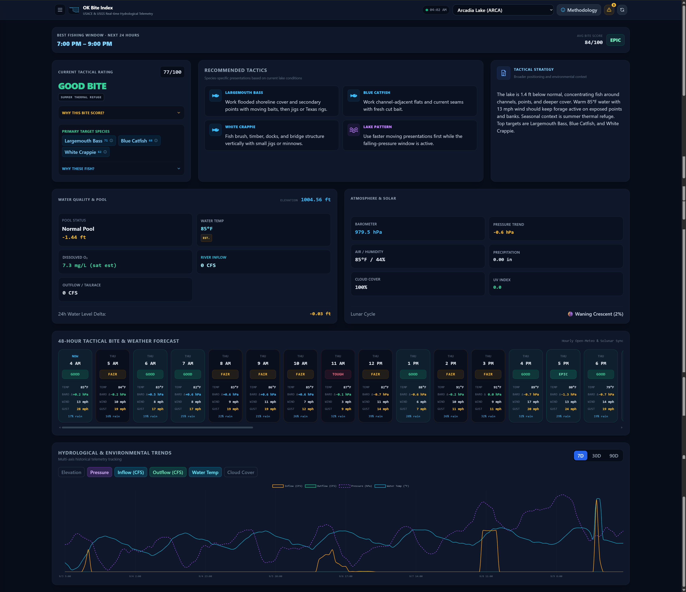
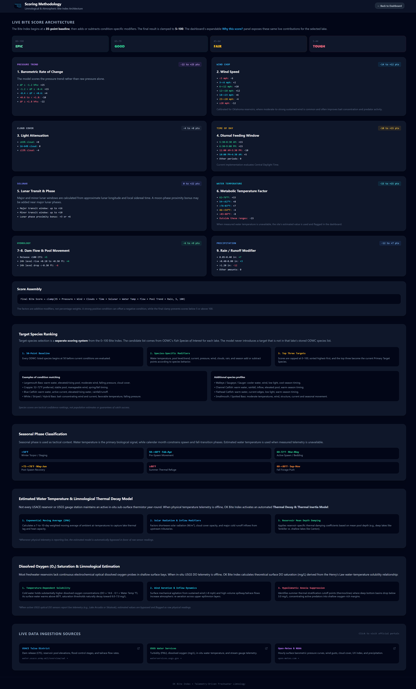

# OK Bite Index

Oklahoma lake telemetry, fishing-condition analysis, forecasting, and tactical recommendation platform.

OK Bite Index combines real-time hydrological and weather observations with lake-specific data to generate a dynamic fishing Bite Index, target-species rankings, recommended tactics, fishing windows, and lake-condition analysis.

## Screenshots

### Main Dashboard



### Scoring Methodology



## Features

- Real-time Oklahoma lake telemetry
- Current weather conditions and forecasts
- Lake elevation and normal-pool deviation monitoring
- Inflow and dam release monitoring where available
- Water temperature and water-quality observations where available
- Dynamic 0–100 Bite Index
- Target-species rankings and explainable heuristic scores
- Condition-based fishing tactics
- Seasonal fishing-pattern analysis
- Best three-hour fishing window and peak individual hour for the next 24 hours
- Per-metric source provenance and bounded data freshness
- Archived source observations and issued forecast/analysis snapshots
- ODWC fishing regulations and lake-species information
- Data-source freshness monitoring
- Related-project alerts
- Responsive desktop, tablet, and mobile interface

## Data Sources

### USGS

USGS monitoring stations provide available hydrological and water-quality observations. Depending on the station, these can include:

- Water-surface elevation
- Discharge / flow
- Water temperature
- Dissolved oxygen

Available parameters vary by lake and monitoring station. Hefner uses the modern USGS Water Data API with explicit reservoir-elevation and tower-temperature series identifiers, parameter codes, and units. Alternate elevation series are excluded. An optional `USGS_API_KEY` can be provided in `.env`.

### USACE

USACE CWMS data is used for configured reservoirs where available, including reservoir elevation, reference levels, inflow, and release.

### Open-Meteo

Open-Meteo provides current atmospheric conditions and forecast data used by the Bite Index and fishing-window calculations, including:

- Air temperature
- Surface pressure
- Wind speed
- Cloud cover
- Precipitation
- UV index

### Oklahoma Department of Wildlife Conservation

ODWC data is synchronized to provide lake-specific fishing information, including:

- Fishing regulations
- Species information
- Links to official ODWC lake and fishing resources

### City of Edmond ArcGIS

The City of Edmond's Current Public and Capital Improvement Projects ArcGIS StoryMap is used to monitor projects related to Arcadia Lake.

Related-project ingestion is currently limited to **Arcadia Lake**.

## Bite Index

The Bite Index is a rule-based score from **0–100** describing relative fishing conditions. Its biological weights have not been validated against catch and fishing-effort data; the score is not a catch probability.

The analysis combines available environmental and lake-condition factors such as:

- Water temperature
- Atmospheric pressure
- Time of day
- Seasonal phase
- Lake elevation relative to normal pool
- Weather conditions
- Available lake telemetry

The interface also provides an explanation of the factors contributing to the current score.

## Target Species & Tactics

Current lake and weather conditions are evaluated to identify likely target species and appropriate fishing tactics.

The interface provides:

- Ranked target species
- Species heuristic scores, not calibrated confidence estimates
- Condition-based ranking explanations
- Recommended tactics
- Seasonal fishing pattern
- Tactical strategy

Species information links to official ODWC fishing resources where available.

Both tactics and strategy use known pool and water-trend conditions. Missing readings remain unknown and do not earn ranking points. Species presentations adapt to supported conditions; estimated temperatures are qualified. Strategy provides a concise action plan without repeating telemetry or the species list. Reported inflow and dam release are distinguished from actual current at the fishing location, and a lake-wide seasonal phase does not imply verified spawning for every species.

## Fishing Forecast

OK Bite Index generates a short-term fishing forecast using forecast weather conditions and environmental factors used by the Bite Index.

The interface identifies the **Best 3-hour Window for the Next 24 Hours**, based on the strongest average across consecutive usable forecast hours, and shows the **Peak Hour** separately. Dates and times use the browser's local timezone. Past hours and windows with missing scores are excluded; missing forecasts clear the previous recommendation.

Current and forecast calculations use the same three-hour pressure difference and one-hour rainfall accumulation. Solar and lunar timing use lake coordinates and PyEphem events. Forecast reservoir temperature and hydrology are held at the available current baseline rather than independently predicted.

## Data Quality and Historical Records

Metric state preserves observation/retrieval timestamps, source payloads, and carried-forward status. Weather inputs expire after one hour, CWMS observations after four hours, and Hefner USGS readings after six hours. Essential missing or stale weather suppresses the Bite Index instead of becoming calm wind or clear skies.

The application creates additive quality fields and the `lake_metric_state`, `lake_observations`, and `bite_predictions` tables at startup. Source observations and revisions are retained separately. Backfill reanalysis does not overwrite an existing live weather reading, and older observations cannot replace newer metric state.

Historical charts use the reference applied to each observation rather than assuming a static nominal pool. Stored history predating quality tracking cannot gain missing provenance retroactively. Failed regulations parsing preserves existing text; current legal rules should still be checked with ODWC.

## Related Projects

Related-project monitoring is currently enabled **only for Arcadia Lake**.

The ingestor checks the City of Edmond's **Current Public and Capital Improvement Projects** ArcGIS StoryMap once per calendar day and identifies projects explicitly associated with Arcadia Lake.

Project information can include:

- Project name
- Background
- Current project update
- Construction cost
- Funding
- Anticipated completion
- Source modification time
- Official project source

Related projects are displayed through the **Related Projects** indicator in the web interface. Individual projects use collapsible details to conserve screen space on desktop and mobile devices.

### Current Scope

Automatic related-project discovery is intentionally limited to **Arcadia Lake** for now.

Other Oklahoma lake project sources are not automatically ingested until a sufficiently reliable authoritative source and project-to-lake relationship can be validated. This prevents unrelated agency news, navigation content, and generic notices from being presented as lake-related projects.

## Architecture

OK Bite Index runs as a Docker Compose stack with three primary services:

| Service | Container | Purpose |
| --- | --- | --- |
| `timescaledb` | `ok_lakes_db` | TimescaleDB / PostgreSQL database |
| `ingestor` | `ok_lakes_ingestor` | Telemetry ingestion and recurring synchronization scheduler |
| `web` | `ok_lakes_web` | FastAPI REST service and responsive web interface |

All services communicate over the `ok_fishing_net` Docker bridge network.

## Ports

| Service | Host Port | Container Port |
| --- | ---: | ---: |
| TimescaleDB | `5432` | `5432` |
| Web | `8088` | `8000` |

The web interface is available at:

```text
http://<docker-host>:8088
```

## Persistent Storage

TimescaleDB data is stored on the Docker host at:

```text
${DOCKER_ROOT}/ok_lakes/data
```

Database initialization is provided by:

```text
${DOCKER_ROOT}/ok_lakes/01_init.sql
```

and mounted read-only inside the database container at:

```text
/docker-entrypoint-initdb.d/01_init.sql
```

The initialization script runs automatically when PostgreSQL initializes a new database data directory.

## Prerequisites

- Docker Engine
- Docker Compose

Documentation:

- https://docs.docker.com/engine/install/
- https://docs.docker.com/compose/

## Environment Configuration

Copy the example environment file:

```bash
cp .env.example .env
```

Configure the required values:

```env
POSTGRES_USER=lake_admin
POSTGRES_PASSWORD=<POSTGRES PW>
POSTGRES_DB=ok_fishing_db
TZ=America/Chicago
DOCKER_ROOT=<Data Location>
USGS_API_KEY=
```

## Deployment

Build and start the complete stack:

```bash
docker compose --env-file .env up -d --build
```

Verify container status:

```bash
docker compose --env-file .env ps
```

Monitor the ingestor:

```bash
docker compose --env-file .env logs -f ingestor
```

Monitor the web service:

```bash
docker compose --env-file .env logs -f web
```

Monitor TimescaleDB:

```bash
docker compose --env-file .env logs -f timescaledb
```

## Ingestor

The ingestor image is built from:

```text
${DOCKER_ROOT}/ok_lakes/ingestor
```

using `python:3.11-slim`.

The image installs:

- `requests`
- `psycopg2-binary`

All Python files in the `ingestor` directory are copied directly into `/app`.

The container starts the main daemon with:

```text
python -u ingest.py
```

### Ingestor Components

| Script | Purpose |
| --- | --- |
| `ingest.py` | Main 15-minute telemetry daemon and recurring synchronization scheduler |
| `active_projects.py` | Arcadia related-project discovery and synchronization |
| `odwc_regs.py` | ODWC fishing-regulation scraping and database synchronization |
| `odwc_species.py` | ODWC lake-species synchronization |
| `backfill.py` | Unified historical recovery utility for lake levels, flows, measured Hefner water temperature, and weather |

Standalone synchronization scripts can also be run manually inside the container.

For example:

```bash
docker compose --env-file .env exec ingestor \
  python /app/active_projects.py
```

## Ingestion Schedule

The main `ingest.py` daemon wakes every **15 minutes**. Telemetry is collected every cycle, while lower-frequency synchronization jobs use persistent PostgreSQL scheduler state to determine whether they are due.

### Telemetry — Every 15 Minutes

Each telemetry cycle retrieves available:

- Open-Meteo current weather
- USGS reservoir observations for Hefner, including elevation and measured water temperature
- USACE CWMS reservoir elevation, reference-level, inflow, and release observations

A new lake reading is then stored in TimescaleDB.

### ODWC Regulations — Every 7 Days

ODWC fishing regulations are synchronized **once every 7 days**.

The last successful synchronization is stored as `odwc_regulations` in `app_sync_state`, so container restarts and rebuilds do not reset the interval.

### ODWC Species — Monthly

ODWC lake-species information is synchronized **once per calendar month**.

The scheduler uses `America/Chicago` when determining the calendar-month boundary and stores its state as `odwc_species` in `app_sync_state`.

### Related Projects — Daily

Related-project synchronization runs **once per calendar day**.

The scheduler uses `America/Chicago` when determining the daily boundary and stores its state as `active_projects` in `app_sync_state`.

Related-project discovery currently processes **Arcadia Lake only**.

Scheduler timestamps are updated only after successful synchronization, allowing failed jobs to be retried by a later daemon cycle.

## Historical Backfill

Historical lake readings can be reconstructed or repaired with the unified `backfill.py` utility. The script supports lake elevation and normal-pool deviation, CWMS inflow and release, Hefner USGS reservoir elevation and measured water temperature, and historical Open-Meteo weather. Estimated water temperature is not persisted by the backfill.

Run all supported backfills in dependency order (**levels → flows → weather**):

```bash
docker compose --env-file .env exec ingestor \
  python -u /app/backfill.py --all --days 60
```

Run an individual stage:

```bash
docker compose --env-file .env exec ingestor \
  python -u /app/backfill.py --levels --days 60

docker compose --env-file .env exec ingestor \
  python -u /app/backfill.py --flows --days 60

docker compose --env-file .env exec ingestor \
  python -u /app/backfill.py --weather --days 60
```

Restrict a backfill to a lake with `--lake` (repeatable), or specify an explicit historical range with `--start` and `--end`. Use `--dry-run` to retrieve and validate source data without modifying `lake_readings`.

For example:

```bash
docker compose --env-file .env exec ingestor \
  python -u /app/backfill.py --all --lake ARCA --days 2 --dry-run
```

For Hefner (`HEFN`), the level stage uses USGS station `07159550` and backfills both reservoir elevation and measured reservoir water temperature when available. Other configured reservoirs use the current CWMS lake mapping and reference-level logic shared with the main ingestor.

The backfill uses authoritative observations when available and does not fabricate missing boundary-hour telemetry. Consequently, the newest hour can temporarily have weather or elevation data while a completed hourly flow or USGS observation is not yet available.

## Web Interface

The responsive web interface provides a consolidated view of current and forecast fishing conditions.

Major components include:

- Lake selector
- Best Fishing Window
- Current Tactical Rating
- Recommended Tactics
- Tactical Strategy
- Target Species
- Seasonal Pattern
- Lake Conditions
- Weather Conditions
- Data freshness indicators
- Fishing forecast
- ODWC fishing regulations
- Related Projects

The interface automatically adapts between desktop, tablet, and mobile screen sizes.

Water Quality & Pool includes a signed, color-coded **24-hour Pool Change** tile. Missing deltas remain unavailable rather than becoming zero.

## Verification

Run the Python regression suite with the web image's installed dependencies:

```bash
docker compose --env-file .env run --rm --no-deps \
  -v "$PWD:/review:ro" --entrypoint python web \
  -m unittest discover -s /review/tests -v
```

The suite covers source freshness and validation, consistent pressure/rainfall intervals, solar/lunar events, future fishing windows, unavailable inputs, and coherent tactics under low, falling, unknown, and estimated conditions.

The optional browser checks require Node.js, Playwright and Chromium installed in your test environment. They use `BASE_URL` (default `http://127.0.0.1:8088/`), `PLAYWRIGHT_MODULE` (default `playwright`) and optional `CHROMIUM_EXECUTABLE` overrides:

```bash
node tests/browser-smoke.cjs
node tests/browser-window.cjs
```

The persistence integration script is separate from test discovery and refuses to run unless the database is named `accuracy_test`. Use `tests/schema.sql` only to initialize a fresh disposable test database. `tests/integration_persistence.py` verifies observation deduplication, newer-state preservation and non-overwriting reanalysis, and rolls back its test transaction. Never initialize the fixture in your production database.

## API

The FastAPI web service exposes lake data through REST endpoints.

```text
GET /api/lakes
GET /api/lakes/{lake_code}/analysis
GET /api/lakes/{lake_code}/forecast
GET /api/lakes/{lake_code}/history
```

### Lake List

```text
GET /api/lakes
```

Returns the configured lake list.

### Analysis

```text
GET /api/lakes/{lake_code}/analysis
```

Returns the current lake analysis used by the primary dashboard.

### Forecast

```text
GET /api/lakes/{lake_code}/forecast
```

Returns forecast fishing conditions and the calculated best fishing window.

### History

```text
GET /api/lakes/{lake_code}/history
```

Returns historical lake observations.

## Development

After changing ingestor code:

```bash
docker compose --env-file .env up -d --build ingestor
```

After changing the web application:

```bash
docker compose --env-file .env up -d --build web
```

Inspect logs after rebuilding:

```bash
docker compose --env-file .env logs --tail=100 ingestor
docker compose --env-file .env logs --tail=100 web
```

## Project Status

OK Bite Index is under active development.

Data availability varies by lake because not every reservoir has the same USGS, USACE, or water-quality telemetry available.

The application uses available authoritative observations where possible and supplements lake analysis with weather and lake-specific logic when direct telemetry is unavailable.

### Application logging

Web and ingestion emit JSON Lines to stdout and persistent files under
`${DOCKER_ROOT}/ok_lakes/logs`. UTC timestamps, severity, service, and event
identify each record. `LOG_LEVEL` defaults to `INFO`; HTTP access logs are disabled.

| Host directory | File allowlist |
| --- | --- |
| `ok_lakes/logs/web` | `application.log`, `application.log.[1-5]` |
| `ok_lakes/logs/ingestor` | `application.log`, `odwc_species.log`, `active_projects.log`, `backfill.log`, and each file's `.1` through `.5` backups |

Each application file rotates at 10 MiB and keeps five backups. Maintenance
subprocesses use separate files to avoid sharing rotating handlers across
processes. Regulations run in the ingestor process and use `application.log`.
Run manual backfill through the ingestor container so the same log mount applies;
avoid concurrent runs of the same maintenance script sharing a file.
Docker's stdout copies are capped separately at three 10 MB files per container,
including the database; database-native file logging remains unchanged.

Telemetry logs include a cycle ID, committed-lake counts, duration, freshness,
and missing/carried metrics. A degraded lake in a cycle summary means at least
one essential bite-score input is missing (pressure trend, wind, or cloud cover);
optional missing water telemetry is reported separately and does not alone mark
a lake degraded. Success is logged after commit. Provider failures and unexpected
API errors include redacted tracebacks. Logs exclude request bodies, headers,
query strings, connection strings, and raw provider payloads.
